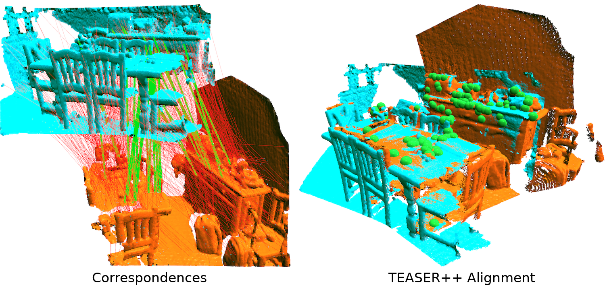

# TEASER++: fast & certifiable 3D registration 
[](https://opensource.org/licenses/MIT)
[](https://teaser.readthedocs.io/en/latest/?badge=latest)
[](https://github.com/MIT-SPARK/TEASER-plusplus/actions)


TEASER++ is a fast and certifiably-robust point cloud registration library written in C++, with Python and MATLAB bindings.

## About

*Left: correspondences generated by [3DSmoothNet](https://github.com/zgojcic/3DSmoothNet) (green and red lines represent the inlier and outlier correspondences according to the ground truth respectively). Right: alignment estimated by TEASER++ (green dots represent inliers found by TEASER++).*

TEASER++ can solve the rigid body transformation problem between two point clouds in 3D. It performs well even if the input correspondences have an extremely large number of outliers. For a short conceptual introduction, check out our [video](https://www.youtube.com/watch?v=xib1RSUoeeQ). For more information, please refer to our papers:
- [H. Yang](http://hankyang.mit.edu/), [J. Shi](http://jingnanshi.com/), and [L. Carlone](http://lucacarlone.mit.edu/), "TEASER: Fast and Certifiable Point Cloud Registration,". [arXiv:2001.07715](https://arxiv.org/abs/2001.07715) [cs, math], Jan. 2020. ([pdf](https://arxiv.org/pdf/2001.07715.pdf))
- [H. Yang](http://hankyang.mit.edu/) and [L. Carlone](http://lucacarlone.mit.edu/), “A Polynomial-time Solution for Robust Registration with Extreme Outlier Rates,” in Robotics: Science and Systems (RSS), 2019. ([pdf](https://arxiv.org/pdf/1903.08588.pdf))

If you find this library helpful or use it in your projects, please cite:
```bibtex
@article{Yang20tro-teaser,
  title={{TEASER: Fast and Certifiable Point Cloud Registration}},
  author={H. Yang and J. Shi and L. Carlone},
  journal={{IEEE} Trans. Robotics},
  pdf={https://arxiv.org/pdf/2001.07715.pdf},
  Year = {2020} 
}
```

If you are interested in more works from us, please visit our lab page [here](http://web.mit.edu/sparklab/).

## TL;DR
### Minimal C++ example
Run the following script to show a minimal C++ example:
```shell script
sudo apt install cmake libeigen3-dev libboost-all-dev
git clone https://github.com/MIT-SPARK/TEASER-plusplus.git
cd TEASER-plusplus && mkdir build && cd build
cmake .. && make
sudo make install
sudo ldconfig
cd .. && cd examples/teaser_cpp_ply && mkdir build && cd build
cmake .. && make
./teaser_cpp_ply
```
You should see terminal output like this:
```shell script
	Read 1889 total vertices 
*** [pmc heuristic: thread 1]   current max clique = 577,  time = 0.00163579 sec
...
*** [pmc: thread 2]   current max clique = 602,  time = 0.44515 sec
-----------------------------------------------------------------------
=====================================
          TEASER++ Results           
=====================================
Expected rotation: 
  0.996927  0.0668736 -0.0406664
 -0.066129   0.997618  0.0194009
 0.0418676 -0.0166518   0.998978
Estimated rotation: 
  0.996658  0.0729647  0.0367288
-0.0740469   0.996832  0.0290182
-0.0344951 -0.0316408   0.998904
Error (deg): 0.0783556

Expected translation: 
 -0.115577
-0.0387705
  0.114875
Estimated translation: 
 -0.116132
-0.0390858
   0.11729
Error (m): 0.00249818

Number of correspondences: 1889
Number of outliers: 1700
Time taken (s): 0.786677
```
### Minimal C++ example for MacOS with brew:
Run the following script to show a minimal C++ example:
```shell script
brew install cmake
brew install boost
brew install eigen
git clone https://github.com/MIT-SPARK/TEASER-plusplus.git
cd TEASER-plusplus && mkdir build && cd build
cmake .. && make
sudo make install
cd .. && cd examples/teaser_cpp_ply && mkdir build && cd build
cmake .. && make
./teaser_cpp_ply
```
### Minimal Python 3 example
Run the following script to show a minimal Python 3 example (needs Anaconda installed):
```shell script
sudo apt install cmake libeigen3-dev libboost-all-dev
conda create -n teaser_test python=3.6 numpy
conda activate teaser_test
conda install -c open3d-admin open3d=0.9.0.0
git clone https://github.com/MIT-SPARK/TEASER-plusplus.git
cd TEASER-plusplus && mkdir build && cd build
cmake -DTEASERPP_PYTHON_VERSION=3.6 .. && make teaserpp_python
cd python && pip install .
cd ../.. && cd examples/teaser_python_ply 
python teaser_python_ply.py
```
You should see output similar to this:
```shell script
==================================================
        TEASER++ Python registration example      
==================================================
*** [pmc heuristic: thread 1]   current max clique = 563,  time = 0.00185895 sec
...
*** [pmc: thread 2]   current max clique = 605,  time = 0.618481 sec
-----------------------------------------------------------------------
=====================================
          TEASER++ Results           
=====================================
Expected rotation: 
[[ 0.99692656  0.06687358 -0.04066644]
 [-0.06612899  0.99761788  0.01940087]
 [ 0.04186755 -0.01665178  0.99897777]]
Estimated rotation: 
[[ 9.96883589e-01  7.88648224e-02 -1.85738207e-03]
 [-7.88858464e-02  9.96487579e-01 -2.80985536e-02]
 [-3.65129272e-04  2.81575081e-02  9.99603432e-01]]
Error (deg): 
0.06284342361637997
Expected translation: 
[-0.11557694 -0.03877054  0.11487489]
Estimated translation: 
[-0.11652176 -0.0373522   0.111885  ]
Error (m): 
0.0034414811018018978
Number of correspondences:  1889
Number of outliers:  1700
Time taken (s):  0.9492652416229248
```

### Reproduce the GIF Above 
Run the following script:
```shell script
sudo apt install cmake libeigen3-dev libboost-all-dev
conda create -n teaser_3dsmooth python=3.6 numpy
conda activate teaser_3dsmooth
conda install -c open3d-admin open3d=0.9.0.0
conda install scikit-learn 
git clone https://github.com/MIT-SPARK/TEASER-plusplus.git
cd TEASER-plusplus && mkdir build && cd build
cmake -DTEASERPP_PYTHON_VERSION=3.6 .. && make teaserpp_python
cd python && pip install .
cd ../.. && cd examples/teaser_python_3dsmooth
python teaser_python_3dsmooth.py
```
You should be able to see Open3D windows showing registration results:


## Getting Started
- Installation
  - [Dependencies](https://teaser.readthedocs.io/en/latest/installation.html#installing-dependencies)
  - [Compilation](https://teaser.readthedocs.io/en/latest/installation.html#compilation-and-installation)
  - [Install C++ Libraries](https://teaser.readthedocs.io/en/latest/installation.html#installing-c-libraries-and-headers)
  - [Install Python Bindings](https://teaser.readthedocs.io/en/latest/installation.html#installing-python-bindings)
  - [Install MATLAB Bindings](https://teaser.readthedocs.io/en/latest/installation.html#installing-matlab-bindings)
  - [Run Tests](https://teaser.readthedocs.io/en/latest/installation.html#run-tests)
- Usage
  - [In C++](https://teaser.readthedocs.io/en/latest/quickstart.html#usage-in-c-projects)
  - [In Python](https://teaser.readthedocs.io/en/latest/quickstart.html#usage-in-python-projects)
  - [In MATLAB](https://teaser.readthedocs.io/en/latest/quickstart.html#usage-in-matlab-projects)
  - [In ROS](https://teaser.readthedocs.io/en/latest/quickstart.html#usage-in-ros-projects)
- API Documentation
  - [C++](https://teaser.readthedocs.io/en/latest/api-cpp.html)
  - [Python](https://teaser.readthedocs.io/en/latest/api-python.html)
  - [MATLAB](https://teaser.readthedocs.io/en/latest/api-matlab.html)

## Other Publications
Other publications related to TEASER include:
- [H. Yang](http://hankyang.mit.edu/) and [L. Carlone](http://lucacarlone.mit.edu/), “A quaternion-based certifiably optimal solution to the Wahba problem with outliers,” in Proceedings of the IEEE International Conference on Computer Vision (ICCV), 2019, pp. 1665–1674. ([pdf](https://arxiv.org/pdf/1905.12536.pdf))
- [H. Yang](http://hankyang.mit.edu/), [P. Antonante](http://www.mit.edu/~antonap/), [V. Tzoumas](https://vasileiostzoumas.com/), and [L. Carlone](http://lucacarlone.mit.edu/), “Graduated Non-Convexity for Robust Spatial Perception: From Non-Minimal Solvers to Global Outlier Rejection,” IEEE Robotics and Automation Letters (RA-L), 2020. ([pdf](https://arxiv.org/pdf/1909.08605))

## Acknowledgements
This work was partially funded by ARL DCIST CRA W911NF-17-2-0181, ONR RAIDER N00014-18-1-2828, Lincoln Laboratory “Resilient Perception in Degraded Environments”, and the Google Daydream Research Program.
