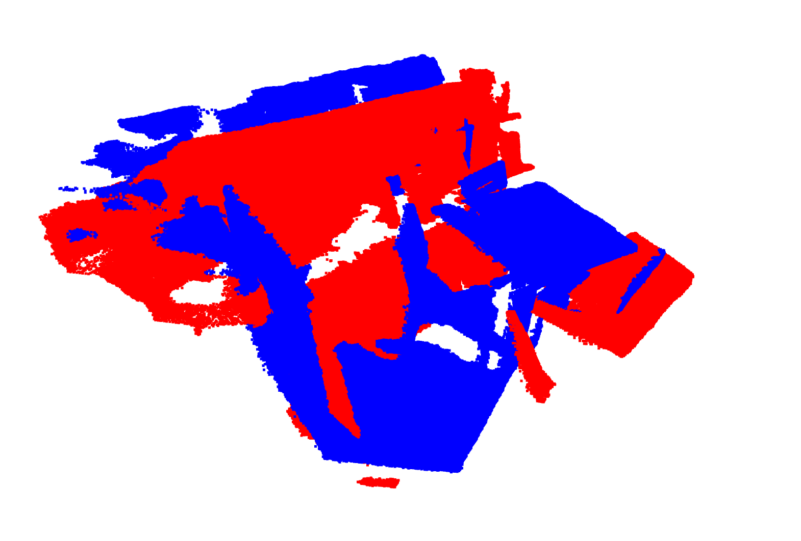
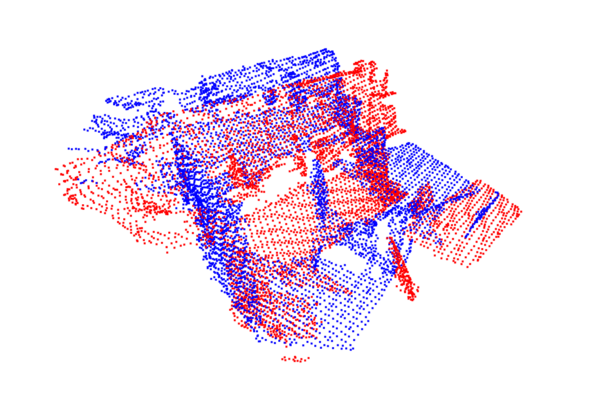
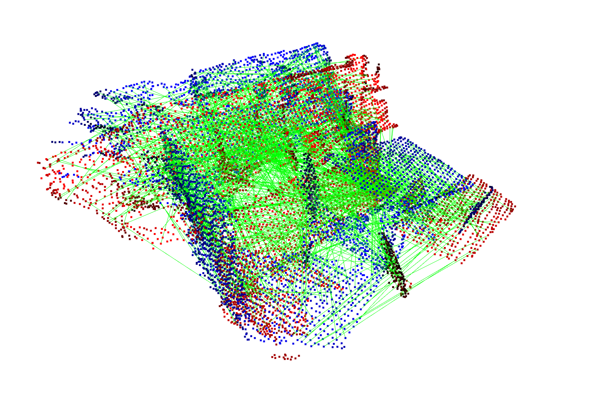
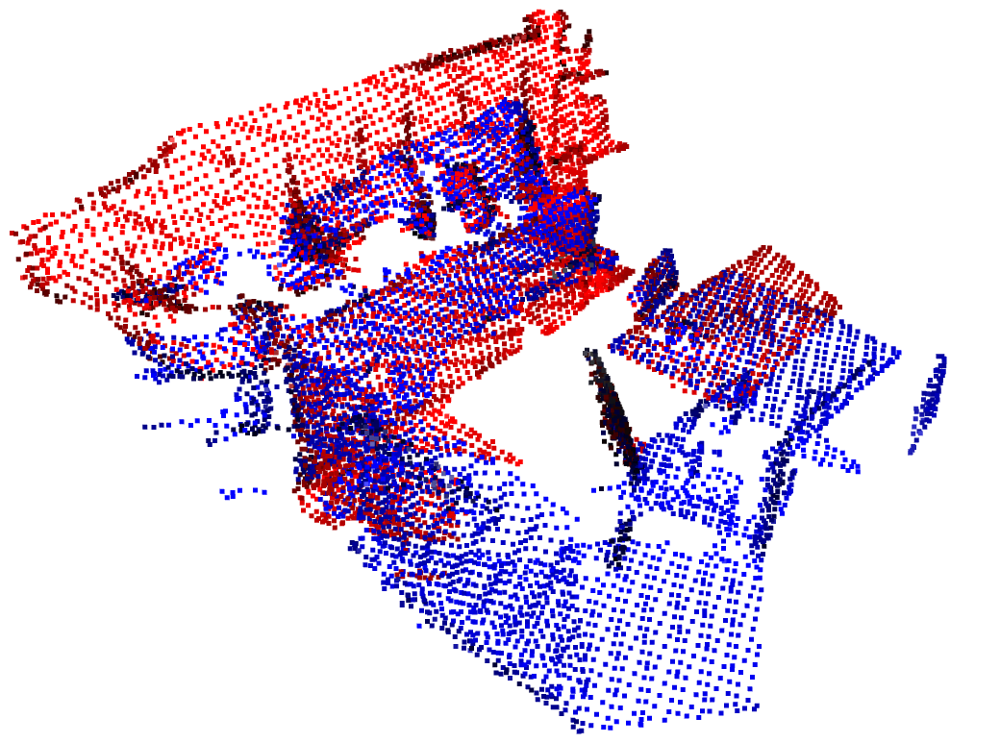

# Tutorial: Registration on 3DMatch with FPFH + TEASER + ICP

## Prerequisites
- [Install Conda](https://docs.conda.io/projects/conda/en/latest/user-guide/install/#regular-installation)
- Create a conda environment called `py3-teaser`:
```shell
conda create -n py3-teaser python=3.6
```
- Activate `py3-teaser` and install packages:
```shell
conda activate py3-teaser
conda install scipy
pip install open3d
```
- Within `py3-teaser` environment, [build and install TEASER++'s python bindings](https://github.com/MIT-SPARK/TEASER-plusplus#minimal-python-3-example) (no need to download TEASER repo inside this folder):
```shell
git clone https://github.com/MIT-SPARK/TEASER-plusplus.git
cd TEASER-plusplus && mkdir build && cd build
cmake -DTEASERPP_PYTHON_VERSION=3.6 .. && make teaserpp_python
cd python && pip install .
```

## Registration Tutorial
3D registration is a fundamental problem in computer vision and robotics, and it seeks to find the best rigid transformation between two sets of 3D points (eg., obtained from Lidar scans or RGB-D cameras). Registration finds extensive applications in localization and mapping, object detection and 3D reconstruction.

Registration is a well-known chicken-and-egg problem: 
- **Chicken**: given correct point-to-point correspondences (eg., suppose one has an oracle that can precisely tell which point in cloud B corresponds to certain point, say the eye of a bunny, in cloud A, or declare the nonexistence of such a correspondence when A and B have non-overlapping segments), compute the rigid transformation;
- **Egg**: given the correct transformation, figure out the correct correspondences.

Each problem, individually, is easy to solve, because the chicken problem can be solved in closed form, and the egg problem boils down to nearest neighbour search in Euclidean space.

However, in practice, there is no oracle for providing (even reasonally good) correspondences, and usually there is no good initial estimate of the transformation -- making 3D registration a challenging problem. 

In this tutorial, we look at one way of solving the problem, that is, we accept the fact that feature correspondences are poor (meaning that a large fraction of the correspondences are wrong, called outliers), but we use TEASER++, an algorithm that can tolerate large amount of outliers, to compute an accurate estimate of the pose. Then, we can (optionally) use a local  algorithm to fine-tune the registration.

One can run the full example by:
```shell
OMP_NUM_THREADS=12 python example.py
```

However, below we provide detailed explanation of the algorithm, and share related insights.

### 1. **Load and visualize a pair of point clouds**

First, we use [Open3D](http://www.open3d.org/) [1] to load a pair of point clouds from the [3DMatch](https://3dmatch.cs.princeton.edu/) [2] test dataset and visualize them:
```python
# Load and visualize two point clouds from 3DMatch dataset
A_pcd_raw = o3d.io.read_point_cloud('./data/cloud_bin_0.ply')
B_pcd_raw = o3d.io.read_point_cloud('./data/cloud_bin_4.ply')
A_pcd_raw.paint_uniform_color([0.0, 0.0, 1.0]) # show A_pcd in blue
B_pcd_raw.paint_uniform_color([1.0, 0.0, 0.0]) # show B_pcd in red
o3d.visualization.draw_geometries([A_pcd_raw,B_pcd_raw]) # plot A and B 
```


The source point cloud, denoted , is painted in blue and the target point cloud, denoted , is painted in red. 

### 2. **Voxel downsampling**

In this case,  has  points and  has  points. To increase registration speed, we perform voxel downsampling and visualize the downsampled point clouds.

```python
VOXEL_SIZE = 0.05
# voxel downsample both clouds
A_pcd = A_pcd_raw.voxel_down_sample(voxel_size=VOXEL_SIZE)
B_pcd = B_pcd_raw.voxel_down_sample(voxel_size=VOXEL_SIZE)
o3d.visualization.draw_geometries([A_pcd,B_pcd]) # plot downsampled A and B 
# extract the coordinates of both clouds as numpy array
A_xyz = pcd2xyz(A_pcd) # np array of size 3 by N
B_xyz = pcd2xyz(B_pcd) # np array of size 3 by M
```


After downsamping, we see that the two point clouds are still highly distinguishable, while now  only has  points and  has only  points.

### 3. **Extract FPFH feature descriptors**

We now compute FPFH [3] feature descriptors for each point in A and each point in B. FPFH feature descriptor is a vector of 33 numbers that describe the *intrisic* local geometric signature of each point (such as angles, distances, and curvature), and hence being invariant to rigid transformation.
```python
# extract FPFH features
A_feats = extract_fpfh(A_pcd,VOXEL_SIZE)
B_feats = extract_fpfh(B_pcd,VOXEL_SIZE)
```
The `extract_fpfh` function is defined in the `helpers.py` script.


### 4. **Establish putative correspondences**

Using the computed FPFH features, we can now associate points in A to points in B by computing the similarity scores between the FPFH descriptors -- similar points should have similar local geometry and therefore also similar FPFH features. We say point  and point  is a pair of corresponding points when the FPFH feature of , denoted  and the FPFH feature of , denoted  are *mutually* **closest** to each other. Formally, this means that , and .

We visualize the correspondences by drawing green lines between corresponding points. We get 981 correspondences and we can tell that many of the feature matches are wrong by eyeballing the visualization.
```python
# establish correspondences by nearest neighbour search in feature space
corrs_A, corrs_B = find_correspondences(
    A_feats, B_feats, mutual_filter=True)
A_corr = A_xyz[:,corrs_A] # np array of size 3 by num_corrs
B_corr = B_xyz[:,corrs_B] # np array of size 3 by num_corrs
num_corrs = A_corr.shape[1]
print(f'FPFH generates {num_corrs} putative correspondences.')

# visualize the point clouds together with feature correspondences
points = np.concatenate((A_corr.T,B_corr.T),axis=0)
lines = []
for i in range(num_corrs):
    lines.append([i,i+num_corrs])
colors = [[0, 1, 0] for i in range(len(lines))] # lines are shown in green
line_set = o3d.geometry.LineSet(
    points=o3d.utility.Vector3dVector(points),
    lines=o3d.utility.Vector2iVector(lines),
)
line_set.colors = o3d.utility.Vector3dVector(colors)
o3d.visualization.draw_geometries([A_pcd,B_pcd,line_set])
```


### 5. **Robust global registration using TEASER++**

Now it is time to show the power of TEASER++ [4]. We feed all putative correspondences to TEASER++ and let TEASER++ compute a transformation to align the corresponding points. **Note that TEASER++ is a correspondence-based algorithm and it takes two numpy arrays of equal number of columns**, 3 x N, where N is the number of matches (not number of points in the original point clouds). Column i of the first array (a 3D point) corresponds to column i of the second array (another 3D point).
```python
# robust global registration using TEASER++
NOISE_BOUND = VOXEL_SIZE
teaser_solver = get_teaser_solver(NOISE_BOUND)
teaser_solver.solve(A_corr,B_corr)
solution = teaser_solver.getSolution()
R_teaser = solution.rotation
t_teaser = solution.translation
T_teaser = Rt2T(R_teaser,t_teaser)
```
We visualize the registration result, and clearly see that TEASER++ correctly aligns the two point clouds.
```python
# Visualize the registration results
A_pcd_T_teaser = copy.deepcopy(A_pcd).transform(T_teaser)
o3d.visualization.draw_geometries([A_pcd_T_teaser,B_pcd])
```



### 6. **Local refinement using ICP**

In some cases, one might want to fine-tune the registration by running ICP on the original dense point clouds, with TEASER++'s solution as an initial guess. This is easily accomplished by calling ICP [5] from Open3D:
```python
# local refinement using ICP
icp_sol = o3d.registration.registration_icp(
      A_pcd, B_pcd, NOISE_BOUND, T_teaser,
      o3d.registration.TransformationEstimationPointToPoint(),
      o3d.registration.ICPConvergenceCriteria(max_iteration=100))
T_icp = icp_sol.transformation

# visualize the registration after ICP refinement
A_pcd_T_icp = copy.deepcopy(A_pcd).transform(T_icp)
o3d.visualization.draw_geometries([A_pcd_T_icp,B_pcd])
```


In this case, we see that the result of TEASER++ is already very accurate, so ICP refinement only produces slightly better registration. ICP refinement could be very helpful if the number of FPFH correspondences is very small and TEASER++ only gets to perform global registration using a set of sparse keypoints.

## References
[1]. Q.-Y. Zhou, J. Park, and V. Koltun. "Open3D: A modern library for 3D data processing." arXiv preprint arXiv:1801.09847, 2018.

[2]. A. Zeng, S. Song, M. Nießner, M. Fisher, J. Xiao, and T. Funkhouser, “3dmatch: Learning the matching of local 3d geometry in range scans,” in Proceedings of the IEEE Conference on Computer Vision and Pattern Recognition, vol. 1, no. 2, 2017, p. 4.

[3]. R. Rusu, N. Blodow, and M. Beetz, “Fast point feature histograms (FPFH) for 3d registration,” in IEEE Intl. Conf. on Robotics and Automation (ICRA). Citeseer, 2009, pp. 3212–3217.

[4]. H. Yang, J. Shi, and L. Carlone, "TEASER: Fast and Certifiable Point Cloud Registration,". arXiv:2001.07715 [cs, math], Jan. 2020.

[5]. P. J. Besl and N. D. McKay, “A method for registration of 3-D shapes,” IEEE Trans. Pattern Anal. Machine Intell., vol. 14, no. 2, 1992.

## Acknowledgements
Thanks to [Wei Dong](http://dongwei.info/) for providing sample code on extracting FPFH features and establishing putative correspondences.


